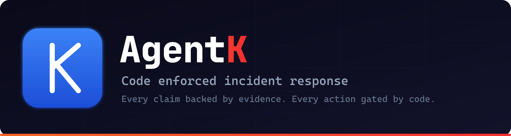
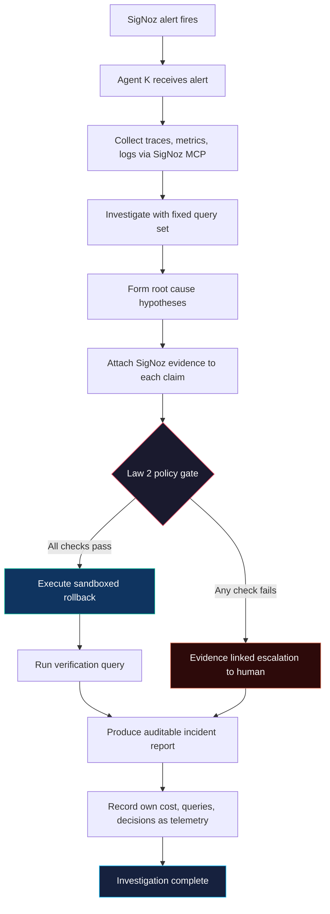

<p align="center">
  
</p>

<p align="center">
  <em>Every claim backed by evidence. Every action gated by code.<br/>
  Nothing is trust the model. Everything is prove it in telemetry.</em>
</p>

<p align="center">
  <a href="https://www.python.org/"></a>
  <a href="https://fastapi.tiangolo.com/"></a>
  <a href="https://www.postgresql.org/"></a>
  <a href="https://github.com/pgvector/pgvector"></a>
  <a href="https://opentelemetry.io/"></a>
  <a href="https://signoz.io/"></a>
  <a href="LICENSE"></a>
  <a href="https://www.wemakedevs.org/hackathons/signoz"></a>
</p>

Agent K is a **code enforced incident response agent** for a FastAPI RAG
support answering service. When a SigNoz alert fires, Agent K investigates
the failure through the SigNoz MCP server, publishes only evidence backed
root cause claims, executes a sandboxed rollback only when a code based
policy allows it, and records its own cost and behavior as telemetry so
every decision is auditable in SigNoz.

Built for the **Agents of SigNoz hackathon** (WeMakeDevs x SigNoz),
Track 01: AI and Agent Observability (July 20 to 26, 2026).

---

## Why Agent K

AI applications can fail in unusual ways: slow, expensive, inaccurate, or
stuck in retry loops, without producing a normal server error. An engineer
usually has to comb through traces, metrics, logs, and deployment history to
understand what happened, and an AI agent that investigates can itself make
unsupported guesses or take unsafe actions.

Agent K makes every investigation **traceable**, every conclusion
**verifiable**, and every action **controlled by code**.

| Problem without Agent K | What Agent K does about it |
| --- | --- |
| Agent makes a root cause guess with no proof | Law 1 strips any claim that has no resolvable SigNoz evidence link |
| Agent recommends an action the model thinks is fine | Law 2 runs a code based policy gate before any action executes |
| Agent runs silently, cost spirals, loops forever | Law 3 records every call, token, query, and verdict as a span |

## The Three Laws (enforced by software, not prompts)

| Law | Rule | What it prevents |
| --- | --- | --- |
| **Law 1** No claim without evidence | A root cause claim cannot be published unless it carries a resolvable SigNoz evidence link (trace, log, metric, or deployment). The report renderer strips any claim with an empty evidence list. | Unsupported assertions reaching the report |
| **Law 2** No action without budget | Before any action, a code based policy checks SLO and burn rate breach, allowlist membership, cooldown, confidence threshold, deployment related cause, and sandbox scope. The allowlist contains exactly one action: rollback to the previous version. | The model executing operational actions on its own recommendation |
| **Law 3** No self without telemetry | Agent K observes itself as carefully as the app: every LLM call, token count, cost, duration, MCP query, hypothesis, and policy verdict becomes a span. A loop breaker stops repeated MCP queries. A cost watchdog stops over budget investigations. | Silent agent behavior and runaway cost |

## How it works



## What is in this repo

| Path | What it is |
| --- | --- |
| `app/` | FastAPI RAG support service (the monitored app) |
| `app/main.py` | Routes plus OTel wiring |
| `app/rag.py` | Retrieval and grounded prompt construction |
| `app/llm.py` | Single OpenAI compatible client (Groq, Cerebras, Gemini) |
| `app/embeddings.py` | Local sentence transformers embeddings |
| `app/db.py` | Async SQLAlchemy plus pgvector session setup |
| `app/models.py` | Document model with pgvector embedding column |
| `app/schemas.py` | Pydantic request and response models |
| `app/telemetry.py` | OTel providers (traces, metrics, logs, OTLP HTTP) |
| `app/observability.py` | Shared gen_ai span attribute helper |
| `data/corpus/` | 72 synthetic support docs (Flowdeck, fictional SaaS) |
| `alembic/` | DB migrations (0001: documents table plus vector ext) |
| `scripts/seed_corpus.py` | Idempotent corpus seeder |
| `scripts/probe_ask_spans.py` | Production span count probe for POST /ask |
| `scripts/time-foundry-cast.sh` | Foundry rebuild duration logger (TELE 02) |
| `tests/` | Offline unit plus live database integration tests |
| `casting.yaml` | SigNoz Foundry deployment manifest |
| `casting.yaml.lock` | Reproducible Foundry lockfile (judged deliverable) |
| `docker-compose.yaml` | rag postgres (pgvector/pgvector:pg16) container |
| `docs/` | All project docs (runbooks, setup, demo, submission) |
| `docs/SIGNOZ-RUNBOOK.md` | Step by step SigNoz standup and first run setup |
| `docs/RUNNING-AGENT-K.md` | Team guide: how to run every component |
| `docs/DEMO.md` | Demo walkthrough and what's real vs fixture |
| `docs/MCP-SETUP.md` | SigNoz MCP server build + verification |
| `docs/HOSTED-DEMO.md` | Hosted demo topology (Vercel + SigNoz Cloud) |
| `docs/SUBMISSION.md` | Hackathon submission + AI usage disclosure |
| `docs/CONTRIBUTING.md` | Setup, testing, and contribution guide |
| `docs/TELEMETRY-REBUILD-LOG.md` | Append only Foundry rebuild duration log |
| `bin/` | Prebuilt SigNoz MCP server binaries (Linux + Windows) |
| `landing/` | Static Next.js marketing site (separate, deploys to Vercel) |

## The monitored application

A **FastAPI RAG support answering service** with:

| Layer | Choice | Why |
| --- | --- | --- |
| Datastore | PostgreSQL 16 plus pgvector | Single datastore for docs and vectors, no separate vector DB |
| Embeddings | sentence transformers `all-MiniLM-L6-v2` (384 dim, local) | Zero budget, no external embedding API |
| LLM client | openai SDK with swappable `base_url` | One client for Groq, Cerebras, Gemini Flash via env var |
| Observability | OpenTelemetry 1.44.0, OTLP HTTP to SigNoz | Traces, metrics, logs, GenAI semconv attributes, free DB spans |

## The four demonstration incidents

Each incident is deliberately seeded via a feature flag or config change and
disclosed as a controlled test failure.

| # | Incident | Seeded by | Expected verdict |
| --- | --- | --- | --- |
| 1 | Prompt regression deployment | Broken prompt template in v2 | Rollback allowed |
| 2 | Retry storm cost runaway | Lowered timeouts cause repeated LLM calls | Rollback allowed (cost SLO alone) |
| 3 | Retrieval latency injection | Artificial pgvector delay | Rollback denied (not deployment caused) |
| 4 | Database pool exhaustion | Too few DB connections | Rollback denied (unsupported failure type) |

## Quick start

### Prerequisites

| Requirement | Version | Notes |
| --- | --- | --- |
| Python | 3.11 or 3.12 | Avoid 3.13, some OTel contrib packages lag |
| Docker | Desktop or Engine plus Compose v2 | 6 to 8 GB memory for SigNoz |
| LLM API key | Groq, Cerebras, or Gemini (free tier) | One is enough, Groq is default |

### 1. Stand up SigNoz via Foundry

```bash
curl -fsSL https://signoz.io/foundry.sh | bash      # install foundryctl (once)
foundryctl gauge -f casting.yaml                    # validate prerequisites
foundryctl forge -f casting.yaml -p ./pours         # generate compose plus lockfile
foundryctl cast -f casting.yaml                     # full pipeline: gauge + forge + up
```

Confirm the stack is up, then complete the required first run setup. See
[`docs/SIGNOZ-RUNBOOK.md`](docs/SIGNOZ-RUNBOOK.md) for the exact steps, including the
first run org and register step that binds the OTLP receivers.

### 2. Start the RAG service datastore

```bash
docker compose up -d                # rag postgres (pgvector/pgvector:pg16)
```

### 3. Configure environment

```bash
cp .env.example .env
# fill in GROQ_API_KEY (and or CEREBRAS_API_KEY / GEMINI_API_KEY)
```

### 4. Install, migrate, seed, run

```bash
python -m venv .venv && source .venv/bin/activate
pip install -r requirements.txt

alembic upgrade head                 # create documents table plus vector extension
python -m scripts.seed_corpus        # embed and upsert the 72 doc corpus
uvicorn app.main:app --reload        # http://localhost:8000
```

Smoke test:

```bash
curl localhost:8000/healthz          # {"status":"ok"}
curl -X POST localhost:8000/ask \
  -H "Content-Type: application/json" \
  -d '{"question":"How do I rotate my API key?"}'
```

## Testing

| Command | What it does |
| --- | --- |
| `pytest` | Offline unit tests (mocked, no DB, no network) |
| `pytest -m integration` | Live database tests (requires rag postgres container) |
| `python scripts/probe_ask_spans.py out.json` | Measure the real /ask span set in a fresh process |

## SigNoz features used

| Feature | Where it shows up |
| --- | --- |
| OpenTelemetry traces | Every /ask request, retrieval, prompt, and LLM call |
| OpenTelemetry metrics | Request rate, error rate, latency, SLO, burn rate |
| Structured logs | Trace correlated log records via LoggingInstrumentor |
| GenAI semantic conventions | gen_ai.* attributes on every model call |
| SigNoz dashboards | One dashboard, four sections (service, incident, agent, audit) |
| SigNoz alerts | Configured separately from the dashboard |
| Query Builder | Used by Agent K for investigation queries |
| SigNoz MCP server | Agent K's client for all evidence collection |
| Trace to log correlation | One click from failure to agent reasoning |
| Trace and span links | Investigation spans link back to incident traces |
| Deployment markers | Mark each version, used by Law 2 cause check |
| Foundry deployment | `casting.yaml` plus `casting.yaml.lock` committed |

## Stack

| Layer | Choice | Version |
| --- | --- | --- |
| Runtime | Python | 3.11 or 3.12 |
| Web framework | FastAPI plus Uvicorn | 0.139.2 / 0.51.0 |
| Datastore | PostgreSQL plus pgvector | 16 / 0.5.0 |
| ORM and driver | SQLAlchemy plus asyncpg | 2.0.51 / 0.31.0 |
| Migrations | Alembic | 1.18.5 |
| Embeddings | sentence transformers | 5.6.0 |
| LLM client | openai SDK | 2.46.0 |
| Observability | OpenTelemetry | 1.44.0 |
| OTLP export | opentelemetry exporter otlp proto http | 1.44.0 |
| SigNoz install | Foundry | foundryctl cast |

## AI assistance disclosure

This project was built with AI coding assistance (Claude Code, GitHub
Copilot), disclosed here per the hackathon rules. A human reviewed and
directed all work. All product claims are grounded in the project planning
documents, and demonstration results are described honestly as four out of
four on four controlled scenarios, not as general production accuracy.

## License

MIT. See [`LICENSE`](LICENSE) for the full text.

## Contributing

See [`docs/CONTRIBUTING.md`](docs/CONTRIBUTING.md) for how to set up, run tests, and
submit changes.
